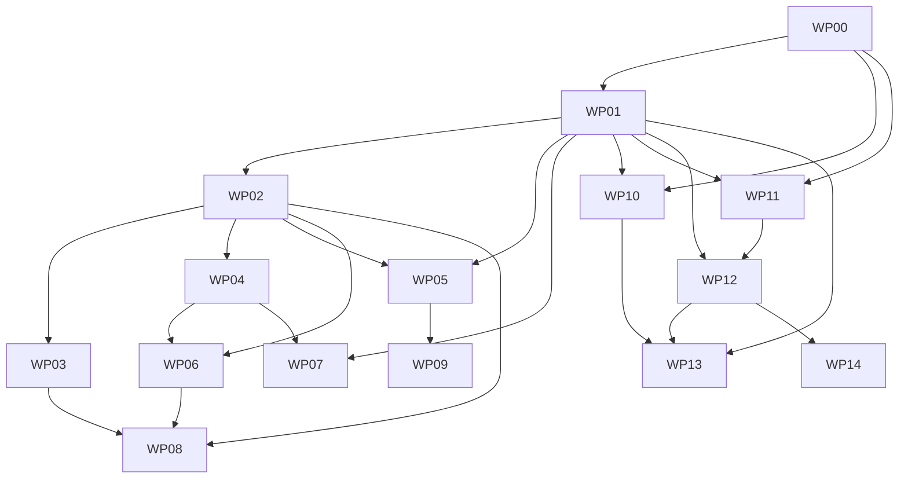

# 02 — Module Dependency Map

**Package:** eBMR / eDHR Claude Code Construction Package  
**Status:** Proposed implementation-ready construction artifact / Ready for Review  
**Specification baseline:** Documents 01–105, baseline date 2026-08-20  
**Purpose:** Control-flow and data-flow edges between platform modules, with contract, trust boundary and failure model.

---

## Control flow (regulated mutation path)

```text
Frappe UI (apps/ebmr_frappe)
  ↓ authenticated server-side call
Identity Context Service
  ↓ subject/tenant/site/qualification context
Authorization / Policy Service (RBAC + qualification + SoD)
  ↓ allow + signature requirement
Electronic Signature Service (fresh step-up, record/version/hash/meaning binding)
  ↓ signature proof
GxP Mutation Gateway (schema, expected_version, idempotency, reason)
  ↓ domain command
Owning domain service (batch / material / QC / QMS / equipment / release)
  ↓ single PostgreSQL transaction
[domain state + record version + audit event + outbox event]
  ↓ after commit
Outbox publisher → NATS JetStream → consumers
  ├→ Frappe projection updater (non-authoritative)
  ├→ Read models / search / reporting (rebuildable)
  ├→ Integration gateway → ERP / LIMS adapters
  └→ Temporal workflow signals (orchestration only)
```

## Edge / OT flow

```text
Device / PLC / peripheral
  ↓ protocol driver (edge/gateway)
Edge store-and-forward buffer (pre-authoritative)
  ↓ signed, sequenced, deduplicated upload
Integration Command Service
  ↓ integration command (non-human identity)
Mutation Gateway → authoritative PostgreSQL commit
```


## Module edges

| From | To | Contract type | Owning contract | Trust boundary | Authoritative source | Failure / retry model |
|---|---|---|---|---|---|---|
| Frappe UI | GxP API (gxp-api) | sync REST | contracts/openapi/gxp-api.yaml | app → GxP core (internal, authenticated) | PostgreSQL | fail closed; no local write; user-visible stable error code |
| GxP API | Policy/Authorization Service | sync internal | Doc 07 IAM contract | in-process/module boundary | iam policy store | deny on unavailable (fail closed, MUT-FR-022) |
| GxP API | Signature Service | sync internal + challenge callback | Doc 04 challenge contract | in-process/module boundary | signature store | no commit without valid signature; challenge expiry |
| GxP API | Audit Ledger | same-transaction write | Doc 05 | same DB transaction | PostgreSQL audit stream | transaction rollback; no state without audit |
| GxP API | Record Version Vault | same-transaction write + object put | Doc 06 / Doc 72 | DB + object store | PostgreSQL + WORM object store | commit fails if manifest/digest cannot be written |
| GxP API | Rules & Calculation Service | sync internal | Doc 08 | in-process/module boundary | released rule versions | fail closed; rule version persisted with result |
| GxP API | Outbox | same-transaction insert | Doc 73 / Doc 101 | same DB transaction | PostgreSQL outbox | at-least-once publish after commit; dedupe by event_id |
| Outbox publisher | NATS JetStream | async publish | contracts/events/* | internal message bus | outbox row | retry with backoff; lag alerting (OutboxLagExceeded) |
| NATS | Frappe projection updater | async consume | Doc 71 | app boundary | projection is non-authoritative | retry; rebuild from authoritative source; staleness flag |
| NATS | Read models / search / analytics | async consume | Doc 75 | internal | rebuildable projections | replay from outbox/stream; never used for regulated decisions |
| NATS | Integration gateway | async consume | Doc 53 | internal → external boundary | GxP truth | idempotent adapter calls; reconciliation ledger; DLQ |
| Integration gateway | ERP (ERPNext/SAP/Oracle/D365) | sync API + async ack | Docs 49–51 | external trust boundary | ERP owns commercial objects; GxP owns regulated state | retry, timeout-uncertain handling, reconciliation |
| Integration gateway | LIMS | adapter contract | Doc 24 | external trust boundary | LIMS result of record per contract; GxP acceptance is a GxP command | idempotent result acceptance; quarantine on mismatch |
| Edge gateway | Integration Command Service | async upload | Docs 43–47 | OT → IT trust boundary | GxP after acceptance | store-and-forward, sequence, replay detection |
| Temporal worker | GxP API | sync command | Doc 74 | internal | domain services | activity retry; workflow state never authoritative |
| AI Gateway | GxP API (read) / retrieval sources | sync read-only | Doc 105 | advisory boundary | authoritative sources only | AI unavailable → normal workflow continues unchanged |
| Postmarket | QMS (complaint/CAPA) | async event + sync read | Docs 35/58/59/60 | internal | QMS records | reportability clock preserved; no silent close |
| Validation platform | All modules | evidence read + fingerprint | Docs 79–96 | internal | immutable evidence store | failed evidence is immutable |

## Work-package dependency graph




## Document-level dependency inventory

| Document | Module | Work package | Depends on (declared in source) |
|---|---|---|---|
| 01 | DOC-001 | WP-00 | — |
| 02 | DOC-002 | WP-00 | — |
| 03 | SPEC-GXP-001 | WP-01 | — |
| 04 | SPEC-GXP-002 | WP-01 | — |
| 05 | SPEC-GXP-003 | WP-01 | — |
| 06 | SPEC-GXP-004 | WP-01 | — |
| 07 | SPEC-IAM-001 | WP-01 | — |
| 08 | SPEC-GXP-006 | WP-01 | — |
| 09 | SPEC-EBMR-000 | WP-02 | Documents 03–08; DDCP profile specs; Material/QC/Packaging specs |
| 10 | SPEC-EBMR-001 | WP-02 | Documents 03–09; Rules Engine; Vault; Materials/QC/Equipment/Packaging specs |
| 11 | SPEC-EBMR-002 | WP-02 | Documents 03–10; Temporal; Material/QC/Equipment/QMS specs |
| 12 | SPEC-EBMR-003 | WP-02 | Documents 03–11; Genealogy; Equipment; Packaging/UDI; QMS |
| 13 | SPEC-EBMR-004 | WP-03 | Documents 03–12; Materials; ERP/WMS; Packaging; Complaint/Recall |
| 14 | SPEC-EBMR-005 | WP-03 | Documents 03–13; QMS; QC; Materials; Packaging; Release |
| 15 | SPEC-EBMR-006 | WP-03 | Documents 03–14; QMS/QC/Materials/Packaging/Equipment/Genealogy |
| 16 | SPEC-EBMR-007 | WP-03 | Documents 03–15; Materials; Edge; ERP/WMS; UDI/Product profile |
| 17 | SPEC-EBMR-008 | WP-03 | Documents 03–16; Rules Engine; Materials; Packaging; QC; Release |
| 18 | SPEC-MAT-001 | WP-04 | Documents 03–09, 17; QMS Supplier Quality/SCAR; ERP Integration |
| 19 | SPEC-MAT-002A | WP-04 | Documents 03–18; Native QC/LIMS; Warehouse; QMS Deviations |
| 20 | SPEC-MAT-002B | WP-04 | Documents 03–19; Genealogy; ERP/WMS; Edge/Barcode |
| 21 | SPEC-MAT-002C | WP-04 | Documents 03–20; Rules Engine; Batch Execution; Edge Gateway/Balance; Equipment |
| 22 | SPEC-MAT-002D | WP-04 | Documents 03–21; Yield/Reconciliation; QMS Deviations; ERP/WMS; Genealogy |
| 23 | SPEC-QC-001 | WP-04 | Documents 03–22; OOS/OOT; LIMS Adapter; Equipment; Rules Engine |
| 24 | SPEC-QC-002 | WP-04 | Documents 03–23; Integration/Event architecture; OOS/OOT |
| 25 | SPEC-QC-003 | WP-04 | Documents 03–24; QMS Deviation/CAPA/Change; Review/Release |
| 26 | SPEC-QMS-001 | WP-05 | Batch, QC/OOS, CAPA, Change Control, Review/Release |
| 27 | SPEC-QMS-002 | WP-05 | Deviation, OOS/OOT, NCR, Complaint, Audit, Supplier, Change Control |
| 28 | SPEC-QMS-003 | WP-05 | Materials, Device History, QC, Supplier Quality, CAPA |
| 29 | SPEC-QMS-004 | WP-05 | Product/Recipe/Document/Training/Validation/Software Release |
| 30 | SPEC-QMS-005 | WP-05 | Vault, E-Signature, Change Control, Training |
| 31 | SPEC-QMS-006 | WP-05 | Document Control, IAM/SoD, Change/CAPA/Deviation, Equipment |
| 32 | SPEC-QMS-007 | WP-05 | Supplier Qualification/ASL, NCR, Deviation, CAPA, Materials |
| 33 | SPEC-QMS-008 | WP-05 | All QMS modules, Change Control, Product/Process specifications |
| 34 | SPEC-QMS-009 | WP-05 | CAPA, Risk, Document Control, Training |
| 35 | SPEC-QMS-010 | WP-05 | Genealogy, OOS/Deviation/CAPA, Postmarket/Reportability, Recall |
| 36 | SPEC-QMS-011 | WP-05 | Genealogy, Complaint, CAPA, ERP/WMS, DDCP PMSR |
| 37 | SPEC-QMS-012 | WP-05 | All QMS modules, Analytics, Management Review |
| 38 | SPEC-EQP-001 | WP-06 | Recipe, Batch Execution, Training, Change, Edge, Cleaning |
| 39 | SPEC-EQP-002 | WP-06 | Equipment, Batch, Packaging, QC, Sterile/Aseptic |
| 40 | SPEC-EQP-003 | WP-06 | Equipment, Cleaning, EM, Sterilization, Batch, QC, QA Review/Release |
| 41 | SPEC-EQP-004 | WP-06 | Aseptic Operations, Edge/Historian, QC/Microbiology, QMS |
| 42 | SPEC-EQP-005 | WP-06 | Equipment, Cleaning, Aseptic, Edge, QC, Genealogy, Release |
| 43 | SPEC-EDGE-001 | WP-06 | Documents 02–08, 11, 38–42; Security/Infrastructure; Integration Gateway |
| 44 | SPEC-EDGE-002 | WP-06 | Document 43; Equipment/EM/Sterile/QC modules; Security |
| 45 | SPEC-EDGE-003 | WP-06 | Documents 43–44; Integration Gateway; Infrastructure/DR |
| 46 | SPEC-EDGE-004 | WP-06 | Documents 20–23, 38, 43–45; Packaging/Dispensing/eDHR |
| 47 | SPEC-EDGE-005 | WP-06 | Documents 11, 38–46; GxP Mutation Gateway; Review/Release; Historian |
| 48 | SPEC-ERP-001 | WP-07 | Documents 18–22, 43–47; Integration Gateway; GxP Mutation Gateway |
| 49 | SPEC-ERP-002 | WP-07 | Document 48; Procurement/Materials/Inventory; Frappe/ERPNext |
| 50 | SPEC-ERP-003 | WP-07 | Document 48; SAP S/4HANA APIs; Materials/Inventory/Procurement |
| 51 | SPEC-ERP-004 | WP-07 | Document 48; Oracle SCM REST; Dynamics integration patterns; customer ERP adapters |
| 52 | SPEC-ERP-005 | WP-07 | Documents 09, 18–20, 48–51; Data Governance |
| 53 | SPEC-ERP-006 | WP-07 | Documents 43–52; Integration Gateway; Observability/Security |
| 54 | SPEC-DDCP-001 | WP-08 | Documents 09–17, 18–25, 38–42; Packaging; Genealogy; QA Release |
| 55 | SPEC-DDCP-002 | WP-08 | Documents 13, 16, 23, 28, 38, 46, 54; Device Testing; Genealogy |
| 56 | SPEC-DDCP-003 | WP-08 | Documents 09–17, 23–25, 38–47; Packaging; Genealogy |
| 57 | SPEC-DDCP-004 | WP-08 | Documents 13, 23–25, 28–29, 38–42, 47; Genealogy; Release |
| 58 | SPEC-PM-001 | WP-09 | Documents 13, 26–37, 54–57; Analytics; Regulatory Reporting |
| 59 | SPEC-PM-002 | WP-09 | Documents 35, 36, 58; Part 4; MDR/eMDR; AEMS; Evidence/Vault |
| 60 | SPEC-PM-003 | WP-09 | Documents 35–36, 58–59; Part 4; Part 806; Field Alert/BPDR; Records Management |
| 61 | SPEC-SEC-001 | WP-10 | Documents 01–08, 29, 43–53; all deployment profiles |
| 62 | SPEC-SEC-002 | WP-10 | Documents 04, 07; Keycloak-compatible identity abstraction; customer IdP |
| 63 | SPEC-SEC-003 | WP-10 | Documents 07, 29, 61–62; Infrastructure/Operations |
| 64 | SPEC-SEC-004 | WP-10 | Documents 03, 07, 43–53; Frappe UI/API; Integration Gateway |
| 65 | SPEC-SEC-005 | WP-10 | Documents 04–06, 43–53, 61–64; Infrastructure |
| 66 | SPEC-SEC-006 | WP-10 | Documents 02, 43–53, 61–65; Kubernetes/cloud/on-prem infrastructure |
| 67 | SPEC-SEC-007 | WP-10 | Documents 05, 26–29, 43–53, 61–66; SIEM/observability |
| 68 | SPEC-SEC-008 | WP-10 | Documents 29, 61–67; CI/CD; Validation; Infrastructure |
| 69 | SPEC-DATA-001 | WP-11 | Documents 02–08, 43–53, 61–68; all domain modules |
| 70 | SPEC-DATA-002 | WP-11 | Documents 03–08, 69; all GxP services; Backup/DR |
| 71 | SPEC-DATA-003 | WP-11 | Documents 01–07, 69–70; Frappe app; optional ERPNext |
| 72 | SPEC-DATA-004 | WP-11 | Documents 05–06, 16, 30, 42–47, 65, 69; Retention/DR |
| 73 | SPEC-DATA-005 | WP-11 | Documents 03, 43–53, 69–70; all async projections/integrations |
| 74 | SPEC-DATA-006 | WP-11 | Documents 02–03, 11, 26–37, 48–60, 69–73 |
| 75 | SPEC-DATA-007 | WP-11 | Documents 15, 37, 58; 61–71; Frappe UI/reporting |
| 76 | SPEC-DATA-008 | WP-11 | Documents 05–06, 65, 69–75; Security Incident Response |
| 77 | SPEC-DATA-009 | WP-11 | Documents 61–68, 69–76; AWS/Azure/on-prem/private cloud |
| 78 | SPEC-DATA-010 | WP-11 | Documents 01–77; all services and deployment profiles |
| 79 | SPEC-VAL-001 | WP-12 | Documents 01–78; Quality/Change/Release |
| 80 | SPEC-VAL-002 | WP-12 | Documents 01, 07, 29, 54–60, 79 |
| 81 | SPEC-VAL-003 | WP-12 | Documents 01–80; all module specifications |
| 82 | SPEC-VAL-004 | WP-12 | Documents 79–81; CI/CD; Evidence Store |
| 83 | SPEC-VAL-005 | WP-12 | Documents 65–78, 79–82 |
| 84 | SPEC-VAL-006 | WP-12 | Documents 03–60, 80–83 |
| 85 | SPEC-VAL-007 | WP-14 | Documents 54–60, 79–84; Customer procedures/training |
| 86 | SPEC-VAL-008 | WP-12 | Documents 61–78, 83; cloud/on-prem deployment |
| 87 | SPEC-VAL-009 | WP-14 | Documents 06, 30, 69–72, 76; customer legacy systems |
| 88 | SPEC-VAL-010 | WP-12 | Documents 03–07, 30, 62, 65, 79–87 |
| 89 | SPEC-VAL-011 | WP-12 | Documents 05–06, 45, 69–76, 79–88 |
| 90 | SPEC-VAL-012 | WP-12 | Documents 43–53, 73–74, 82–89 |
| 91 | SPEC-VAL-013 | WP-12 | Documents 65, 72–77, 82–90 |
| 92 | SPEC-VAL-014 | WP-12 | Documents 61–68, 79–91 |
| 93 | SPEC-VAL-015 | WP-12 | Documents 70–78, 82–92 |
| 94 | SPEC-VAL-016 | WP-12 | Documents 26–29, 79–93; Engineering issue tracker |
| 95 | SPEC-VAL-017 | WP-14 | Documents 79–94; Release/Deployment/Change |
| 96 | SPEC-VAL-018 | WP-12 | Documents 29, 61–78, 79–95 |
| 97 | SPEC-ENG-001 | WP-00 | Documents 02–08, 61–78, 81–82, 98–104 |
| 98 | SPEC-ENG-002 | WP-00 | Documents 01–97; all future implementation tasks |
| 99 | SPEC-ENG-003 | WP-00 | Documents 61–68, 79–98, 103–104 |
| 100 | SPEC-ENG-004 | WP-00 | Documents 06, 69–76, 87, 94–99, 103 |
| 101 | SPEC-ENG-005 | WP-00 | Documents 03, 48–53, 69–75, 90, 97–100 |
| 102 | SPEC-ENG-006 | WP-00 | Documents 03–96, 97–101, 103 |
| 103 | SPEC-ENG-007 | WP-00 | Documents 61–96, 97–102, 104 |
| 104 | SPEC-ENG-008 | WP-00 | Documents 61–68, 97–103, 105 |
| 105 | SPEC-AI-001 | WP-13 | Documents 01–104; Security, Validation, QMS, Postmarket and Engineering |
